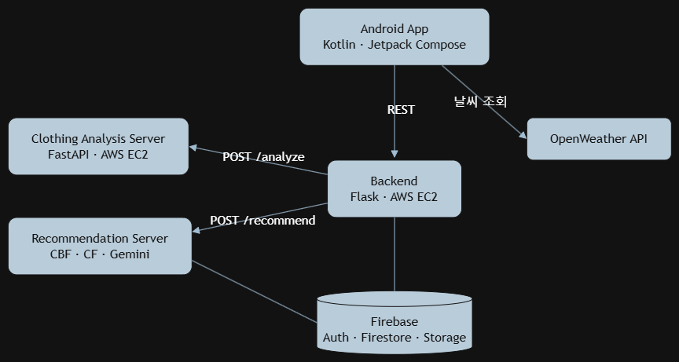

<p align="center">
  
  
  
  
  
</p>

# Wearther (웨어더 - 날씨별 옷차림 추천 서비스)

> **"오늘 날씨에 맞는 옷을, 내 옷장 안에서"**  
> **덕성여자대학교 컴퓨터공학과 졸업 프로젝트 (팀 404_found)**  
> **개발 기간:** 2025. 03. ~ 2025. 10. (약 7개월)

---

## [ 발표 자료 ]
* **최종 발표 자료:** [Releases](https://github.com/ggyyuubb/404_found/releases)

---

## 1. 프로젝트 개요 (Overview)

날씨 앱은 기온별 옷차림 표를 보여주는 데 그치고, 패션 앱이 추천하는 옷은 정작 사용자가 갖고 있지 않은 경우가 많습니다.

**Wearther**는 사용자가 옷 사진을 올리면 AI가 종류·색상·소재·적정 온도대를 분류해 디지털 옷장을 만들고, 실시간 날씨와 사용자 피드백을 반영해 **그 옷장 안에서** 오늘 입을 코디를 추천하는 Android 앱입니다.

### 주요 기능
1. **홈:** 현재 위치의 날씨와 AI 코디 추천을 한 화면에서 확인, 작년 같은 날의 코디와 비교
2. **옷장:** 옷 사진을 올리면 AI가 자동으로 분류해 저장하는 디지털 옷장
3. **커뮤니티:** 사용자 간 코디 공유 및 피드백
4. **설정:** 구글 계정 연동 및 앱 환경 관리

---

## 2. 전체 시스템 아키텍처 (System Architecture)



백엔드가 앱의 요청을 받아 AI 서버(의류 분석, 코디 추천)로 넘기는 구조이고, 각 서버는 REST API로만 통신합니다.

* **옷 등록:** 앱 → 백엔드 `/upload` → 의류 분석 서버 `/analyze` → 사용자 확인·수정 → Firestore 저장
* **코디 추천:** 앱 → 백엔드 `/api/recommend/recommendations/ai` → 추천 서버 → 옷장 데이터와 날씨로 코디 산출 → 앱

---

## 3. 저장소 구조

| 디렉토리 / 브랜치 | 역할 및 기술 스택 | 세부 문서 |
| :--- | :--- | :--- |
| **`fe/`** | Android 앱. 홈·옷장·커뮤니티·설정 화면, Retrofit으로 백엔드 호출 (Kotlin, Jetpack Compose) | - |
| **`be/`** | 백엔드. 인증, 옷 업로드·분석 요청, 코디 추천 요청, 착용 기록, 커뮤니티 API (Python, Flask, Firebase Admin) | - |
| **`clothing_analysis_server/`** | 의류 분석 AI 서버. 옷 사진 → 종류·색상·소재·온도대 JSON (FastAPI, EfficientNet-B3, U2-Net, Claude API) | [README](clothing_analysis_server/README.md) |
| **`master` 브랜치** | 코디 추천 API 로직 (Python, TensorFlow, Gemini API) | - |

---

## 4. AI 모델

### 의류 분석

| 항목 | 방식 | 입력 | 학습 데이터 |
| :--- | :--- | :--- | :--- |
| 의류 종류 | EfficientNet-B3 분류 모델 | 원본 이미지 416×416 | 단일 라벨 21개 클래스, 8,000장 (7,000 + 1,000) |
| 색상 | EfficientNet-B3 분류 모델 | U2-Net 배경 제거 후 256×256 | 멀티 라벨 12개 클래스, 20,000장 |
| 소재·온도대 | Claude API | 원본 이미지 | - |

### 코디 추천

세 가지 엔진을 결합한 하이브리드 모델입니다.

| 모듈 | 역할 | 데이터 |
| :--- | :--- | :--- |
| 콘텐츠 기반 필터링 (CBF) | 하드 룰과 보온치 계산. 날씨 적합성, 방수·방풍, 색상 조화 점수 부여 | 옷장 아이템 메타데이터, 실시간 날씨 |
| 협업 필터링 (CF) | 사용자 행동 기반 잠재 선호도 예측, 추천 다양성 확장 | Firebase 피드백 로그 (SVD 행렬 분해) |
| 개인화 엔진 | 사용자 피드백을 분석해 온도 편향을 반영하고 추천 점수 조정 | Gemini 텍스트 분석, 사용자 프로필 |

* `/explain`: 추천 근거를 한국어 문장으로 제공
* `/feedback`: 사용자 피드백을 바로 학습에 반영해 온도 편향 업데이트
* 매일 새벽 3시 30분 Cron으로 CF 모델 자동 학습·업데이트

---

## 5. 성능 지표 (Key Results)

| 항목 | 지표 | 결과 |
| :--- | :--- | :---: |
| **의류 종류 분류** | Accuracy / Macro-F1 | **93% / 0.92** |
| **색상 추출** | Micro-F1 / Hamming Loss | **0.62 / 0.07** (개별 색상 기준 약 93%) |
| **코디 추천** | 날씨 적합도 | **90% 이상** |


---

## 6. 빠른 시작 가이드 (Quick Start Guide)

### 1) 의류 분석 서버 (`clothing_analysis_server`)
```bash
cd clothing_analysis_server
pip install -r requirements.txt
export CLAUDE_API_KEY="..."
python app.py                # http://localhost:8000
```
모델 가중치(`u2net.pth`, `clothing_classifier.keras`, `color_classifier.keras`)는 용량 문제로 공개하지 않았습니다. `u2net.pth`는 [U-2-Net 공식 저장소](https://github.com/xuebinqin/U-2-Net)에서 받을 수 있고, 의류·색상 모델의 학습 코드는 `clothing_analysis_server/training/`에 있습니다.

### 2) 백엔드 (`be`)
```bash
cd be/login
python com/example/app.py    # http://localhost:8080
```
Firebase 서비스 계정 키를 `be/login/upload/serviceAccountKey.json`에 두고, `be/login/upload/image.py`의 `AI_SERVER`를 의류 분석 서버 주소로 맞춥니다.

### 3) 앱 (`fe`)
Android Studio에서 `fe/`를 열고, `remote/ApiConstants.kt`의 `BASE_URL`을 백엔드 주소로 바꾼 뒤 실행합니다.

---

## 7. 팀원 소개 및 역할 분담 (Team Members & Roles)

| 성명 | 역할 | 
| :--- | :--- |
| **한규빈(팀장)** | 의류 추천 AI 서버 |
| **이고은** | 백엔드 서버 |
| **김주희** | 프론트엔드 |
| **윤서영** | 프론트엔드 |
| **염윤서** | 의류 분석 AI 서버 |
