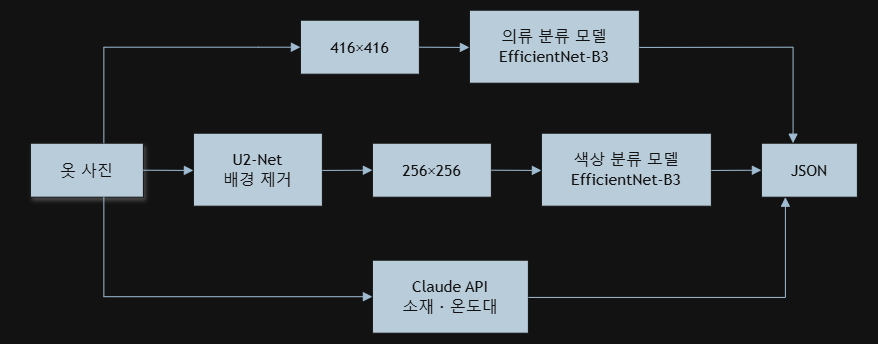

# Clothing Analysis Server (의류 분석 AI 서버)

> 옷 사진 한 장을 받아 **종류(21종) · 색상(12색, 복수) · 소재(14종) · 적정 온도대(8구간)** 를 JSON으로 반환하는 서버입니다.  
> Wearther 백엔드가 옷 등록 시 호출합니다. AWS EC2(Ubuntu)에서 FastAPI로 운영했습니다.

---

## 1. 처리 흐름



* **종류**는 원본 이미지로 판단합니다. 처음에는 U2-Net으로 배경을 지운 뒤 분류했는데, 테스트 정확도 91%인 모델이 서버에 올린 뒤 실제 사진에서는 10장 중 4장밖에 맞히지 못했습니다. 원인은 U2-Net이 실제 사진에서 배경을 제대로 지우지 못하거나 옷 부분까지 잘라내는 것이었고, 분류 경로에서 U2-Net을 빼고 원본 이미지로 다시 학습했습니다.
* **색상**은 옷의 형태와 상관이 없고 배경색을 옷 색으로 잘못 잡는 게 더 큰 문제라서, U2-Net으로 배경을 흰색으로 바꾼 뒤 판단합니다.
* **소재·온도대**는 이미지만으로 학습 데이터를 만들기 어려워 Claude API에 허용 목록을 주고 그 안에서만 답하게 했습니다.

---

## 2. API

### `POST /analyze`
`multipart/form-data`, 필드 이름 `image`

```json
{
  "success": true,
  "clothing_type": "shortsleeve",
  "clothing_big_type": "상의",
  "clothing_confidence": 0.97,
  "colors": ["White", "Black"],
  "color_probabilities": { "White": 0.91, "Black": 0.63 },
  "material": "면",
  "suitable_temperature": "27℃~23℃"
}
```

| 필드 | 값 |
| :--- | :--- |
| `clothing_type` | blazer, cardigan, coat, cotton pants, denim, dress, hood, longpedding, longsleeve, shirt, shortpedding, shorts, shortsleeve, skirt, slacks, sleeveless, sweater, trainingpants, hoodzip, fleece, jumper |
| `clothing_big_type` | 상의, 하의, 아우터, 원피스 |
| `colors` | Beige, Black, Blue, Brown, Gray, Green, Orange, Pink, Purple, Red, White, Yellow 중 확률 0.5 이상 전부 (없으면 가장 높은 1개) |
| `material` | 면, 데님, 린넨/마, 가죽, 퍼/털, 시폰/얇은 원단, 실크/새틴, 스판덱스/신축성 스포츠 원단, 나일론/방수원단, 울/정장소재, 니트/스웨터소재, 벨벳, 트위드 |
| `suitable_temperature` | 28℃~, 27℃~23℃, 22℃~20℃, 19℃~17℃, 16℃~12℃, 11℃~9℃, 8℃~5℃, ~4℃ |

---

## 3. 모델

| 항목 | 의류 분류 | 색상 |
| :--- | :--- | :--- |
| 백본 | EfficientNet-B3 (ImageNet 사전학습) | EfficientNet-B3 (ImageNet 사전학습) |
| 입력 | 416×416, 원본 | 256×256, U2-Net 흰 배경 |
| 출력 | 21종 softmax | 12색 sigmoid |
| 학습 데이터 | 8,000장 (7,000 + 1,000) | 20,000장 |
| 학습 방식 | 백본 동결 → 백본 전체 미세조정, label smoothing 0.1 | 백본 동결 → 상위 50% 미세조정 |
| 결과 | Accuracy 93%, Macro-F1 0.92 | Micro-F1 0.62, Hamming Loss 0.07 |

**데이터:** AI-Hub "의류 통합 데이터(착용 이미지, 치수 및 원단 정보)"를 기반으로 부족한 클래스는 중고거래·이미지 검색 사이트에서 직접 모아 폴더 단위로 라벨링했습니다. 색상 라벨은 같은 데이터셋 JSON의 색상 정보를 사용했습니다.

---

## 4. 개발 과정

| 단계 | 변경 | 정확도 |
| :--- | :--- | :---: |
| 초기 | 224×224, 배치 128, 증강 없음 | 61% |
| 증강 | 회전·왜곡 증강 추가 | 62%, 58% |
| 해상도 | 256×256 | 68% |
| 에폭 | 20 → 60 | 69% |
| 데이터 | 클래스당 100장 → 200장, 13종 | 76% |
| 배경 제거 | U2-Net 적용, 18종 | 87% |
| 재학습 | 21종, 2단계 학습 (U2-Net + EfficientNet-B0) | 91% |
| 서버 통합 | 위 모델로 실제 사진 테스트 | 10장 중 4장 |
| 최종 | 분류 경로에서 U2-Net 제거, 원본 이미지로 재학습 (EfficientNet-B3) | 93% |

* 증강은 초기 데이터가 적을 때 오히려 성능을 떨어뜨려 뺐고, 데이터가 충분히 쌓인 최종 학습에서 다시 넣었습니다.
* ConvNeXt-Tiny도 비교했지만 학습·추론이 무거워 서버용으로는 EfficientNet을 선택했습니다.

---

## 5. 실행

```bash
pip install -r requirements.txt
export CLAUDE_API_KEY="..."
python app.py                        # http://localhost:8000, 문서: /docs
```

모델 가중치는 용량 때문에 저장소에 포함하지 않았습니다. [Releases](../../releases)에서 받아 `models/`에 둡니다. `u2net.pth`는 [U-2-Net 공식 저장소](https://github.com/xuebinqin/U-2-Net)에서도 받을 수 있습니다.

EC2에서는 `scp`로 `app.py`와 모델 파일을 교체한 뒤 `nohup python app.py > server.log 2>&1 &`로 재기동했습니다.

---

## 6. 폴더 구조

```
clothing_analysis_server/
├── app.py            # FastAPI 서버: 전처리, 모델 추론, Claude API 연동
├── model.py          # U2-Net 네트워크 정의
├── requirements.txt
├── training/
│   └── train_models.ipynb   # 의류 분류·색상 모델 최종 학습 코드
└── models/           # Releases에서 받기
    ├── u2net.pth
    ├── clothing_classifier.keras
    └── color_classifier.keras
```
